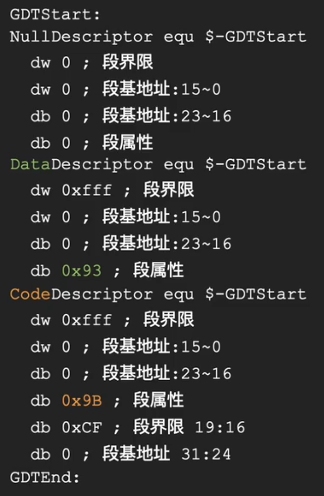
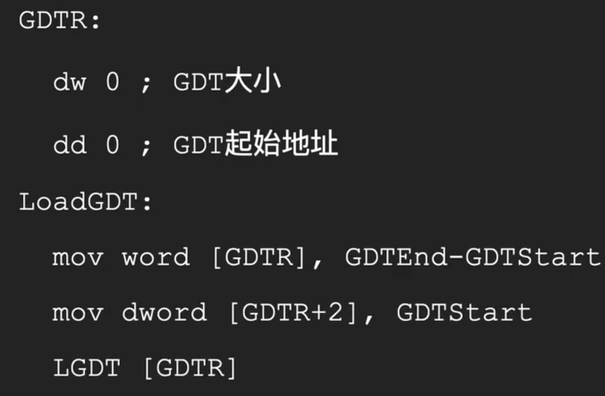
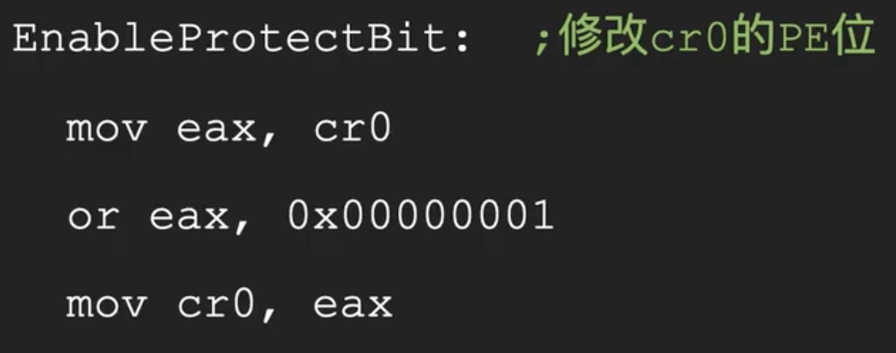
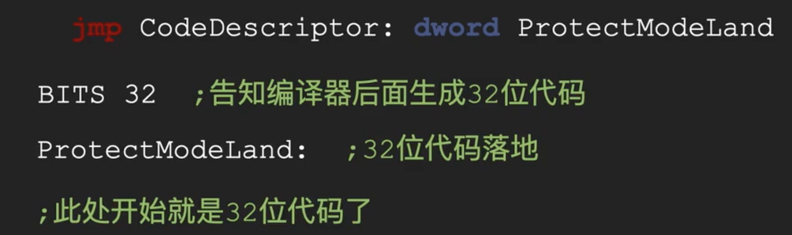

## Real mode to Protect mode
1. 定义GDT
GDT 至少包含3个描述符
- 空描述符
- 代码段描述符
- 数据段描述符
每个描述符 8 bytes

2. 通知CPU
用 LGDT 把 GDT 的大小和位置 加载到 GDTR 寄存器

可以利用 空描述符 的空间存储GDT 的大小和位置

3. 修改PE

4. Jump

## 32 Address
段地址 -> Segment Descriptor -> Base Address -> (Privilege Check) BaseAddr + Offset

## GDT & 

## IDT  

## reference
https://www.bilibili.com/video/BV1a54y1G7Re
